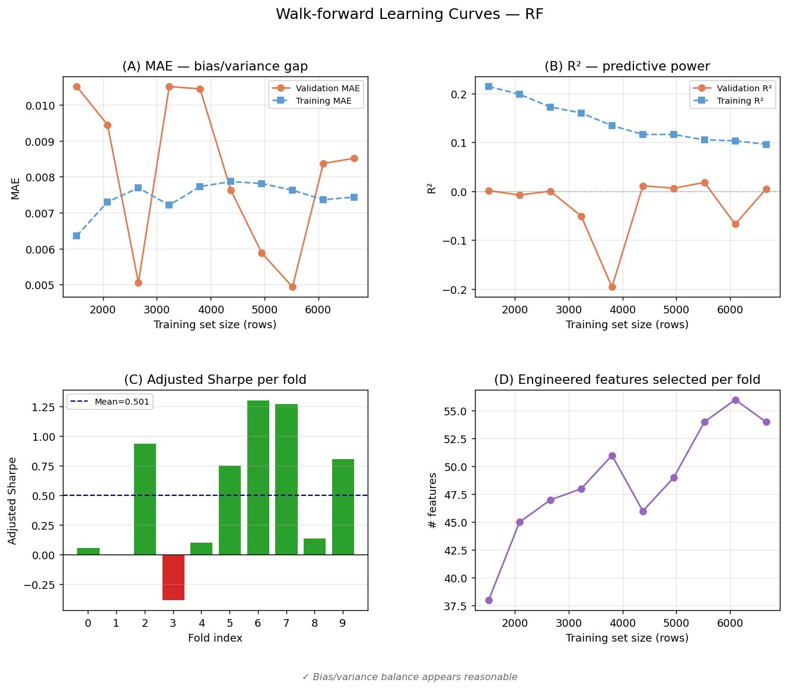
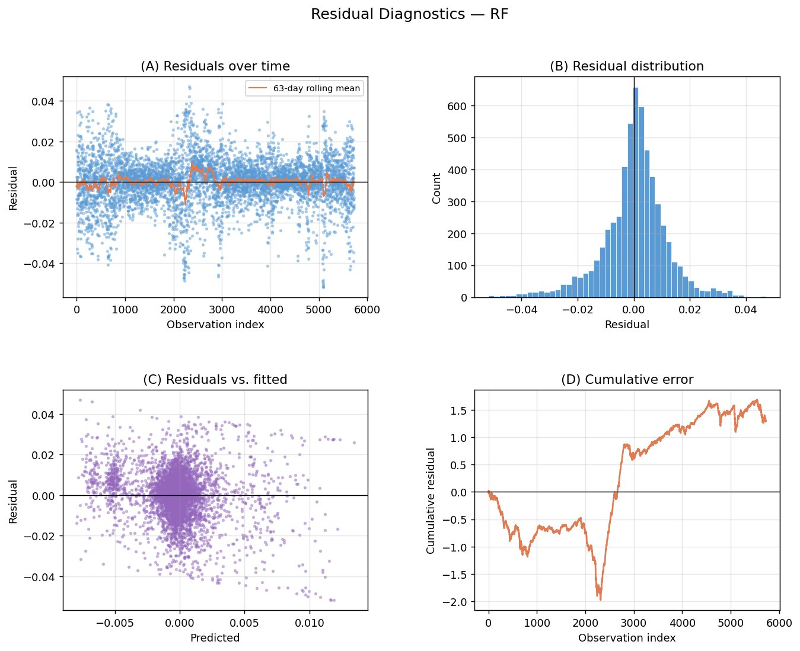

# RF 模型阶段性观察报告

**Phase 1 · 30 trials · 10-fold Walk-Forward CV**

---

## 一、模型选型结论

在7个候选模型中，RF 是唯一值得进入 Phase 2 的模型。

| 模型 | cv10 adj sharpe | IC | 结论 |
|------|----------------|----|------|
| rf | 0.320 | 0.038 | 唯一超过买入持有基准（0.297） |
| xgboost | 0.297 | -0.019 | 模拟买入持有，无真实信号 |
| linear / ridge / elasticnet | 0.23–0.24 | 0.02–0.025 | 线性上限，增加 trials 无突破 |
| lasso | 0.133 | -0.002 | 无预测能力 |
| lightgbm | 0.213 | 0.022 | k=2.96 过度激进，信号质量差 |
| **买入持有基准** | **0.297** | — | 参考基准 |

---

## 二、RF 核心指标

| 指标 | 数值 | 说明 |
|------|------|------|
| cv10 adjusted sharpe（整体） | 0.320 | 超过买入持有基准 +0.023 |
| cv10 adj sharpe（fold 平均） | 0.501 | 多数 fold 表现良好 |
| IC | 0.038 | 所有模型最高 |
| ICIR | 0.353 | 信号稳定性最佳 |
| 最大回撤 | -57.4% | 所有模型中最小 |
| 年化波动率 | 23.0% | 略高于买入持有（17.9%） |
| 胜率 | 42.7% | 低于买入持有（54.2%） |
| k 值 | 0.656 | 适中，未过度激进 |

---

## 三、Fold 级别表现

10个fold中有5个R²为负值（0、1、3、4、8），说明这些时段模型的点预测能力不如直接猜均值。但fold 2、5、6、7、9的adjusted sharpe均超过0.75，说明方向性信号仍然有效，仓位映射弥补了点预测的不足。

Fold 3 是最大问题：训练R²为0.160（正常），验证R²直接跌至-0.051，adjusted sharpe = -0.384。这不是超参问题，而是该时段市场体制与训练集差异过大，模型完全失效。

| Fold | 训练集 | 特征数 | R² | Adj Sharpe | 评级 | 备注 |
|------|--------|--------|----|------------|------|------|
| 0 | 1,512 | 38 | 0.001 | 0.061 | 弱 | 数据量不足 |
| 1 | 2,085 | 45 | -0.008 | -0.003 | 极弱 | |
| 2 | 2,658 | 47 | 0.000 | 0.941 | 优秀 | |
| 3 | 3,231 | 48 | -0.051 | -0.384 | 异常 | 体制切换，最大拖累 |
| 4 | 3,804 | 51 | -0.196 | 0.109 | 弱 | |
| 5 | 4,377 | 46 | 0.011 | 0.754 | 良好 | |
| 6 | 4,949 | 49 | 0.006 | 1.307 | 优秀 | |
| 7 | 5,521 | 54 | 0.018 | 1.276 | 优秀 | |
| 8 | 6,093 | 56 | -0.067 | 0.144 | 弱 | |
| 9 | 6,665 | 54 | 0.005 | 0.810 | 良好 | |

---

## 四、学习曲线分析

**图1：Walk-forward Learning Curves — RF**

**(A) MAE — 偏差/方差**

训练 MAE 稳定在 0.0073–0.0079，验证 MAE 波动剧烈（0.005–0.011）。Gap 存在但不极端，属于轻度过拟合，整体可接受。

**(B) R² — 预测力**

训练R²从0.21持续下滑至0.10，属于正常现象（训练集越大，拟合难度越高）。验证R²整体在0附近，fold 3处出现-0.20低谷，是最明显的异常点。

**(C) Adjusted Sharpe per fold**

整体呈 V 形趋势：早期弱，fold 3崩溃（-0.38），fold 5-7强劲反弹（0.75-1.31），末尾fold 8再次走弱。均值0.501被多个弱折显著拖低。

**(D) 特征数量**

从fold 0的38个逐步增加至fold 8的56个，趋势平滑。这是IC t检验的统计特性：训练集越大，弱信号越容易通过显著性门槛，但不代表特征质量变好。

---

## 五、残差诊断分析

**图2：Residual Diagnostics — RF**

**(A) 残差时序**

63日滚动均值全程贴近0轴，无持续性方向偏差。但在 observation index 2000–3000附近，出现数个-0.04至-0.05的极端点，对应模型严重高估实际跌幅的时段，与fold 3的时间位置吻合。

**(B) 残差分布**

主体接近对称，但右尾（残差 > 0.02）比左尾更厚，呈轻微右偏。含义：模型系统性低估大涨行情——市场大幅上涨时，预测值跟不上实际。策略层面表现为强牛市中仓位不够激进，错失部分上涨收益。

**(C) 残差 vs 拟合值**

呈蝴蝶形散点——预测值接近0时残差最集中，预测值偏极端时误差跟着变大。模型的强信号（预测值大幅偏离0）反而不可靠，在极端市场状态下置信度下降。

**(D) 累积误差**

这是最值得警惕的图。结构分为三段：

- index 0–2500：累积误差从0跌至-2.0，模型持续高估（预测偏高于实际）
- index 2500–5000：急速反弹至+1.6，模型持续低估（预测偏低于实际）
- index 5000–5800：趋于平稳

这不是随机游走，而是典型的市场体制切换特征。前段（熊市/高波动）和后段（牛市/低波动）统计特性差异过大，模型用旧体制数据训练后在新体制下产生系统性反向偏差。

---

## 六、核心问题诊断

| 问题 | 根因 |
|------|------|
| Fold 3 adjusted sharpe = -0.384 | 市场体制切换，模型失效 |
| 累积误差结构性漂移 | 体制切换，误差方向系统性反转 |
| 验证 R² 整体接近 0 | 金融时序固有难度，体制问题加剧 |
| 残差右偏（低估大涨） | MSE 对高估/低估惩罚对称 |
| 强信号时误差反而变大 | 极端市场状态下模型置信度不足 |
| 胜率仅 42.7% | 方向判断准确率有限 |

---

## 七、改进方向（按优先级）

| 行动 | 说明 |
|------|------|
| 查明 Fold 3 时间段 | 定性分析市场环境，是所有后续优化的前提 |
| 加体制感知特征 | 波动率分位数体制、趋势方向体制，类比现有 rate_regime |
| 扩大超参搜索 | trials → 100，扩大 max_depth / min_samples_leaf / max_features 范围 |
| 预测值截断 | 截断至 5%–95% 分位数，避免强信号区域的极端仓位 |

---

## 八、阶段结论

RF 目前是唯一有真实预测信号的模型（IC = 0.038，ICIR = 0.353），整体adjusted sharpe 0.320小幅超过买入持有基准，但稳定性不足——10个fold中只有5个adjusted sharpe超过0.5，4个弱折和1个负折严重拖累了整体表现。

在进入测试集评估之前，体制感知特征是最有潜力将表现提升到下一个台阶的改进方向。单纯增加 trials 或调整超参无法解决市场体制切换的根本问题。
