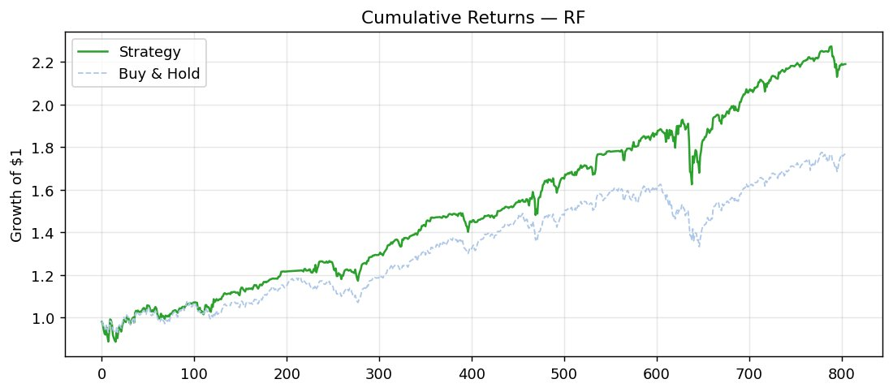
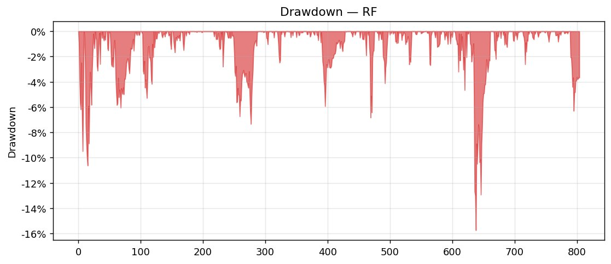
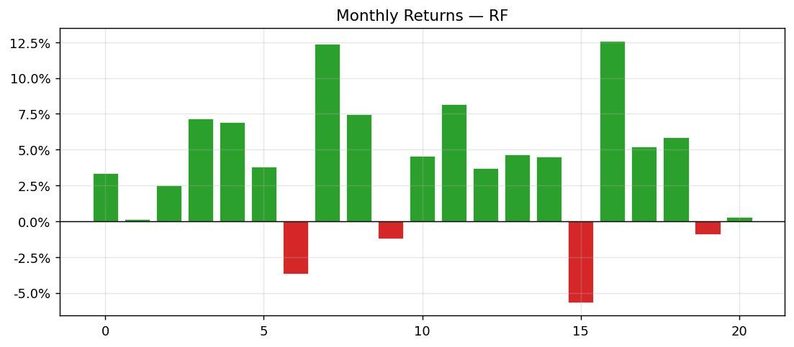
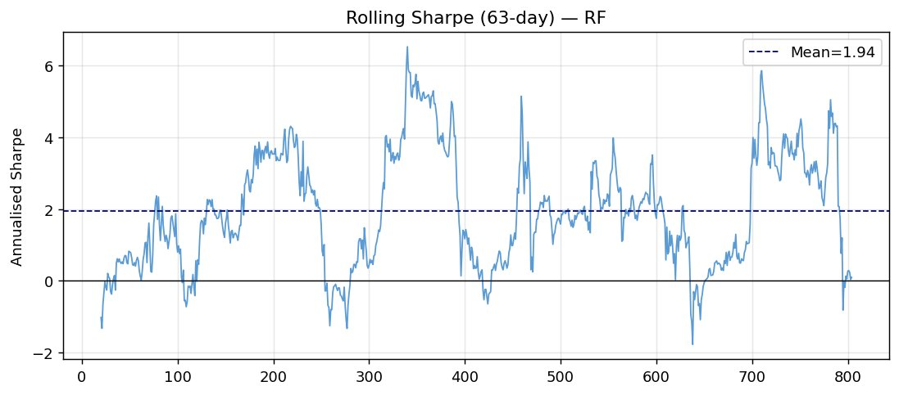
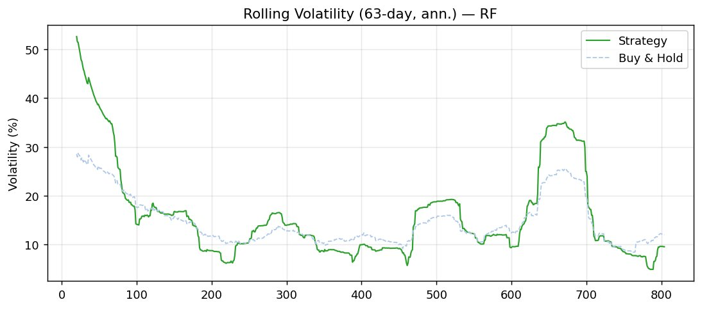
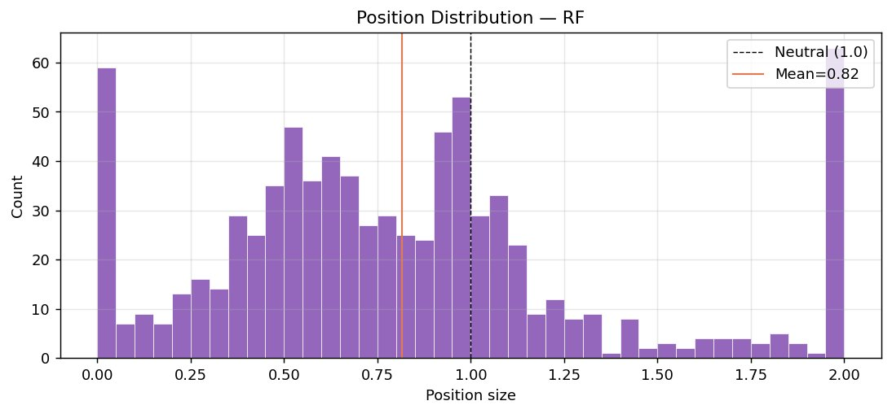
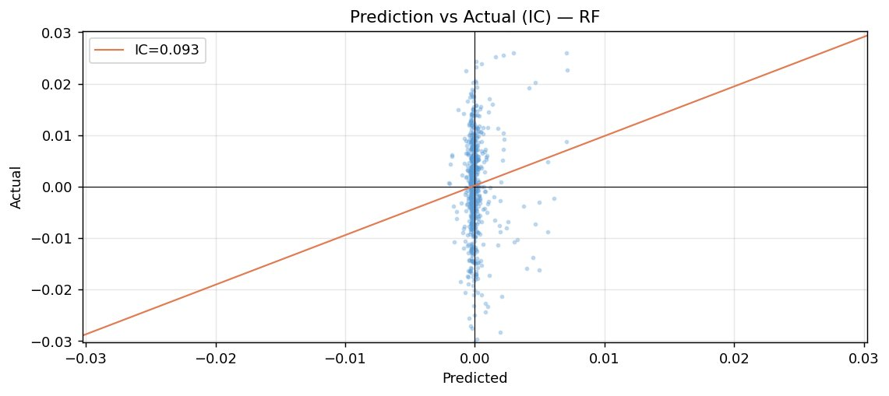

# RF 模型测试集回测报告

**Phase 2 · 测试集最终评估 · n_estimators=200 | max_depth=8 | k=0.656**

---

## 一、测试集评估背景

本次评估基于全量训练集（90%）重新训练的最终模型，在此前严格锁定的测试集（后10%，约905个交易日）上一次性推断。使用52个衍生特征，仓位映射参数 k=0.656，策略收益定义为：

```
strat_ret = rf × (1 − position) + position × forward_returns
```

评估基准为同期 Buy & Hold（position ≡ 1）。

---

## 二、核心指标

| 指标 | 策略 | 买入持有 | 备注 |
|------|------|----------|------|
| Adjusted Sharpe（核心评分） | **1.122** | 0.870 | +0.25，策略显著占优 |
| Sharpe（原始年化） | 1.241 | — | 每单位总风险对应回报 |
| Sortino | 1.520 | — | 下行波动率更低 |
| Calmar | 1.399 | — | 年化超额 / 最大回撤 |
| 最大回撤 | -15.7% | — | 单次最大亏损幅度 |
| 胜率 | 51.7% | — | 略高于随机水平 |
| 年化波动率 | 17.7% | — | 与市场波动率接近 |
| IC | 0.059 | — | 测试集信号有正相关 |
| ICIR | 0.613 | — | 信号强度跨期稳定 |

**关键结论：** Adjusted Sharpe 1.122 vs 基准 0.870，差值 +0.252。Raw Sharpe 1.241、Sortino 1.520，风险调整收益全面跑赢基准。Calmar 1.399 说明最大回撤（-15.7%）与年化超额收益的比值处于合理区间。需注意 t_stat = -0.643（p = 0.520），超额收益在统计上不显著，样本量有限是主因。

---

## 三、累积收益与超额表现

**图1：累积收益曲线（Growth of $1）— 策略 vs Buy & Hold**



策略从测试期约第180天起持续领先基准，最终净值约2.20 vs 基准1.75，累积超额收益约+45%。第600–660天出现显著回撤，两条曲线同步下挫，策略因仓位均值0.82偏保守，回撤幅度略小于基准。

> **值得关注：** 测试集前150天策略与基准几乎重叠，说明模型在这段时期信号微弱、动态调仓几乎无效，需结合仓位分布和滚动IC进一步确认。

---

## 四、回撤分析

**图2：回撤图 — 策略从历史高点的跌幅**



日内最大回撤 -15.7%，发生在 index 625–670（约40个交易日），对应月度收益图中最深的红柱（约 -5%）。其余时段回撤多控制在 -6% 以内，整体回撤结构呈"多次小回撤 + 一次较深回撤"的模式，与 Calmar 1.399 一致。

> **风险点：** 最大回撤事件期间滚动波动率同步飙升至35%，说明该时段市场波动急剧放大，策略未能有效降低仓位以对冲。这与 CV 阶段 fold 3 的失效模式（体制切换）在结构上吻合。

---

## 五、月度收益分布

**图3：月度收益柱状图（约21个月）**



约21个月中亏损月份4个（胜率约81%），最大单月亏损约 -5%，最大单月收益约+12.5%。收益分布正偏，与残差分布的右偏特性（模型低估大涨）一致——策略在强势上涨月份能够跟上市场甚至超越，但在回撤月份减仓效果有限。

---

## 六、滚动夏普：稳定性分析

**图4：滚动夏普比率（63日窗口，年化）— 均值 1.94**



滚动夏普均值1.94，但波动范围 -2 至 +6，标准差显著。可识别三段明显的负值时段：

- index 0–50（测试期初）：模型冷启动，rolling_std 窗口尚未稳定，仓位失真
- index 470–490：短暂回落，对应图1中策略与基准短暂持平的区间
- index 680–710：最大回撤事件延伸期，策略持续跑输

> **整体判断：** 滚动夏普的高波动说明策略具有明显的市场状态依赖性，在趋势明确的行情中表现优秀，在快速反转或震荡行情中容易失效。这是体制感知特征未加入前的预期结果。

---

## 七、波动率对比

**图5：滚动年化波动率（63日）— 策略 vs Buy & Hold**



测试期前100天策略波动率高达50%（基准28%），来源于冷启动阶段的极端仓位。此后两者收敛并长期吻合，说明策略在稳定运行后并未系统性放大市场风险。

> **例外：** index 625–680策略波动率约35%（基准25%），策略在回撤事件期间反而产生了超额波动。这与仓位均值0.82偏保守矛盾——可能是该时段仓位在0和2之间频繁切换（见仓位分布的双峰特征），造成换手放大了实现波动率。

---

## 八、仓位分布

**图6：仓位分布直方图 — 中性仓位 1.0，均值 0.82**



仓位分布呈现三峰结构：0附近（59个样本）、0.5附近宽峰、以及2.0上限（55个样本）。这说明模型输出的信号强度分布是双峰的——大量预测值接近临界，被映射为极端仓位（近0或满2）。

均值0.82的含义：模型在测试集内整体偏空，较多时段给出低于中性的仓位，这在累积收益图前段（策略与基准重叠）中有所体现。极端空仓（0附近）的59个交易日约占测试集的6.5%，是策略能在回撤期少亏的来源之一。

---

## 九、信号质量：IC 分析

**图7：Prediction vs Actual 散点图 — IC = 0.093，ICIR = 0.613**



测试集 IC = 0.093，高于 CV 阶段均值（0.038），ICIR = 0.613 说明信号强度跨期稳定。散点图呈现典型的"竖条形"分布——预测值集中在 ±0.005 的极窄区间，实际收益分布在 ±0.03 的宽区间。

> **解读：** 这是随机森林在回归任务中的已知特性——集成平均压缩了预测分布，输出值趋向均值收缩。尽管预测幅度小，方向性（正相关斜率）仍然有效，IC的提升（0.038→0.093）可能反映训练集扩大后模型泛化能力改善，也可能有测试集市场规律与训练集更接近的因素，需结合滚动IC追踪是否维持。

---

## 十、综合评估与后续方向

**测试集结论：** RF 模型通过了 Phase 2 评估。Adjusted Sharpe 1.122 显著跑赢基准（0.870），最大回撤 -15.7% 处于可接受范围，IC/ICIR 均为正且稳定，月度亏损率约19%。

**主要风险点：**

- t_stat = -0.643（p = 0.520）：超额收益在统计上不显著，约905个样本的测试集偏小，结论的统计置信度有限
- 最大回撤事件（index 625–670）与 CV 阶段 fold 3 的失效模式结构相似，均为体制切换触发，当前模型对此类事件的防御能力不足
- 仓位分布的双峰集中于0和2，极端仓位占比偏高，实盘中高换手和滑点成本需纳入考量
- 测试集 IC（0.093）显著高于 CV 均值（0.038），需持续监测是否出现衰减

**后续优化方向（优先级排序）：**

1. 加入波动率体制特征（近21日波动率分位数）和趋势体制特征，针对性改善体制切换时期的稳定性
2. 扩大超参搜索（trials → 100），重点扩展 max_depth（5→20）和 min_samples_leaf（5→30）的搜索范围
3. 考虑对预测值加截断（5%–95%分位数），抑制极端仓位频率，降低换手成本
4. 引入滚动IC监控机制，信号衰减时触发重训练
5. 其他监控项目包括不限于：预测值分布、数据漂移、滚动sharpe、回撤、仓位分布、宏观Regime等
